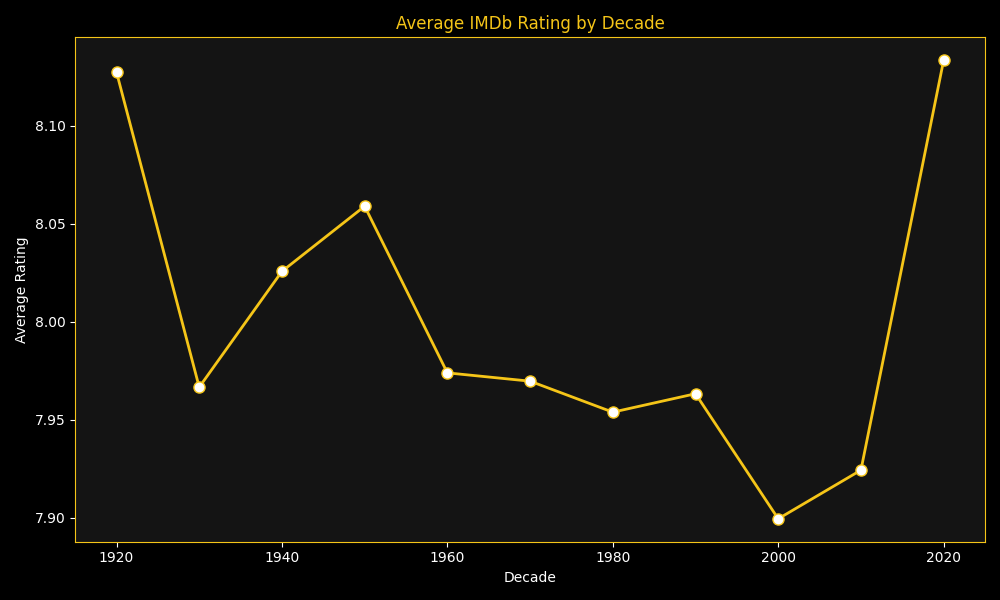
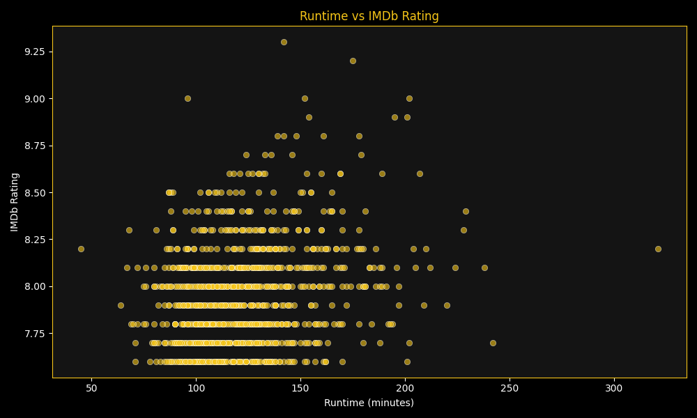
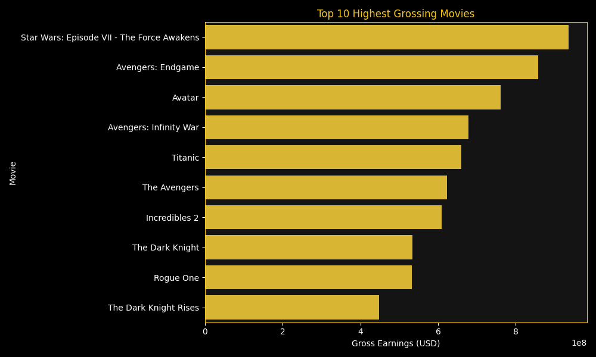

# IMDb Top 1000 Movies — A Data-Driven Exploration

## Why I Built This

Cinema has always fascinated me, not just as entertainment but as a dataset waiting to be interrogated. The IMDb Top 1000 list represents nearly a century of critically acclaimed filmmaking, and I wanted to move beyond passive consumption and actually quantify the patterns hidden within it. What genres dominate critical acclaim? Has quality perception shifted across decades? Which directors have consistently earned a place among the greats?

This project is my attempt to answer these questions through rigorous data analysis rather than assumption or anecdote. Raw data is rarely analysis-ready, so a substantial part of this work involved cleaning inconsistent formatting, handling missing values, and transforming the dataset into something meaningful before a single chart could be produced.

## What I Used

- **Python** as the core language for the entire pipeline
- **Pandas** for data wrangling — parsing malformed strings, converting types, and restructuring the dataset
- **Matplotlib** and **Seaborn** for constructing visualizations that communicate insight rather than just display numbers

## Key Findings

- **Drama** dominates the list as the single most represented genre, with Action and Comedy trailing behind
- **Alfred Hitchcock** holds the record for most films in the Top 1000, a testament to his sustained critical relevance across decades
- Average ratings have remained remarkably stable over time, hovering between 7.9 and 8.1 regardless of era — suggesting the bar for "greatness" hasn't shifted much
- Blockbuster franchises like **Star Wars** and the **Avengers** series dominate the gross earnings charts, though high box office numbers don't always correlate with the highest ratings
- Runtime shows no meaningful relationship with rating — long films aren't inherently better received than short ones

## Visualizations


*Genre distribution across the Top 1000 — Drama leads by a considerable margin*


*Average IMDb rating has stayed largely consistent across nearly a century of cinema*


*The directors with the most recurring appearances on this list*


*No strong correlation emerges between a film's length and its critical reception*


*Commercial success, measured independently of critical acclaim*

## Project Structure

```
imdb_project/
├── imdb_analysis.py       # Core script — cleaning, transformation, and analysis logic
├── imdb_top_1000.csv      # Source dataset (via Kaggle)
├── top_genres.png
├── rating_by_decade.png
├── top_directors.png
├── runtime_vs_rating.png
└── top_grossing.png
```

## Running It Yourself

```bash
pip install pandas matplotlib seaborn
python imdb_analysis.py
```

The script will clean the dataset and generate all five visualizations as PNG files in the working directory.

## Data Source

[IMDb Top 1000 Movies dataset](https://www.kaggle.com/) — sourced via Kaggle.
