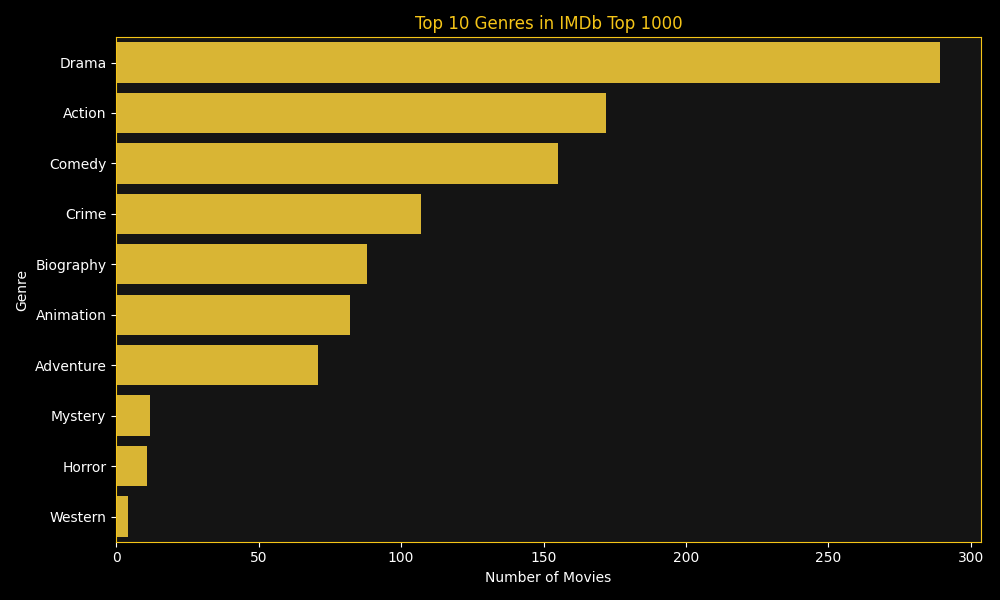
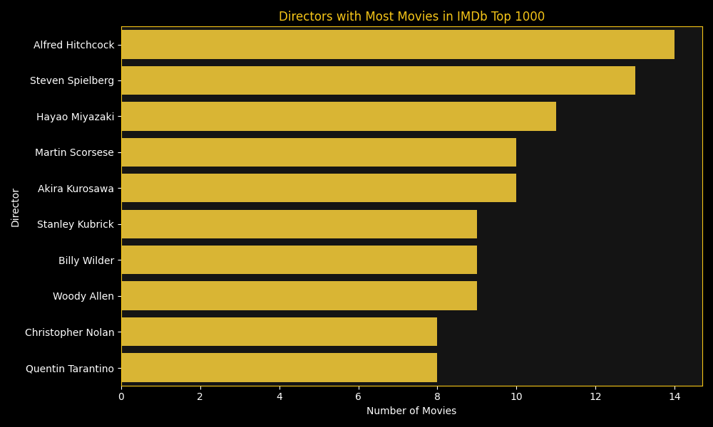

# IMDb Top 1000 Movies - Data Analysis

A data analysis project exploring IMDb's Top 1000 movies dataset using Python, Pandas, and Matplotlib/Seaborn.

## What This Project Does

- Cleans and processes raw IMDb movie data (handles missing values, formats runtime & gross earnings)
- Analyzes trends across genres, directors, ratings, and box office performance
- Generates visual insights through charts

## Key Insights

- **Drama** is the most common genre in the Top 1000 list, followed by Action and Comedy
- **Alfred Hitchcock** has the most movies (14) in the list, followed by Steven Spielberg and Hayao Miyazaki
- Average IMDb ratings have remained fairly consistent across decades (7.9 - 8.1 range)
- **Star Wars: The Force Awakens** and **Avengers: Endgame** are the highest grossing movies in the dataset
- No strong correlation found between movie runtime and IMDb rating

## Tech Stack

- **Python**
- **Pandas** - data cleaning and manipulation
- **Matplotlib & Seaborn** - data visualization

## Project Structure

```
imdb_project/
├── imdb_analysis.py       # Main analysis script
├── imdb_top_1000.csv      # Dataset (source: Kaggle)
├── top_genres.png         # Chart: most common genres
├── rating_by_decade.png   # Chart: average rating trend by decade
├── top_directors.png      # Chart: directors with most movies
├── runtime_vs_rating.png  # Chart: runtime vs rating relationship
└── top_grossing.png       # Chart: highest grossing movies
```

4. Charts will be saved as PNG files in the same folder

## Dataset

Source: [IMDb Top 1000 Movies dataset on Kaggle](https://www.kaggle.com/)

## Sample Charts



